###  RISC-V实体设备LicheePi Module 3A安装deepin操作系统 测试记录

##  一、镜像烧录

**工具准备**

操作环境： win11  设备： LicheePi 3A  [板卡介绍](https://wiki.sipeed.com/hardware/zh/lichee/K1/lpi3a/1_intro.html)
测试镜像版本：deepin-23-beige-preview-riscv64-musebox-20240815-115503

**烧录参考**：

[Sipeed wiki](https://wiki.sipeed.com/hardware/zh/lichee/K1/lpi3a/3_burn_image.html)    or    [进迭时空](https://developer.spacemit.com/documentation?token=O6wlwlXcoiBZUikVNh2cczhin5d)

工具：[Titan Flasher](https://cloud.spacemit.com/prod-api/release/download/tools?token=titantools_for_windows_X86_X64)

**镜像获取**：

deepin20240815 地址:

https://ci.deepin.com/repo/deepin/deepin-ports/cdimage/20240815/riscv64/

下载：deepin-23-beige-preview-riscv64-musebox-20240815-115503.
  及  uboot-k1-spacemit.zip
  
**辅助工具：（用途后文解释）**

Bianbu 镜像包:

https://archive.spacemit.com/image/k1/version/bianbu/v2.0rc2/

**烧录过程** 

按住 boot 将开发板 usb 连接电脑，使用 titan 扫描设备能扫描到即可

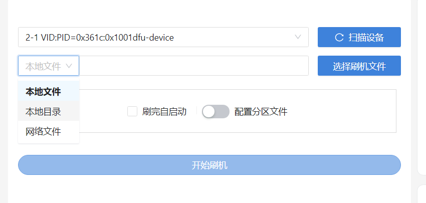

本地文件需要打包好的 zip 格式，使用zip的话还需要再 titan 工具内解压，需要一定时间。

*建议手动解压完成后使用本地目录刷机

目前,如果只使用deepin的两个文件解压（*win 下需使用 7-zip 解压）拼起来作为刷机目录的话会发现缺失配置文件:

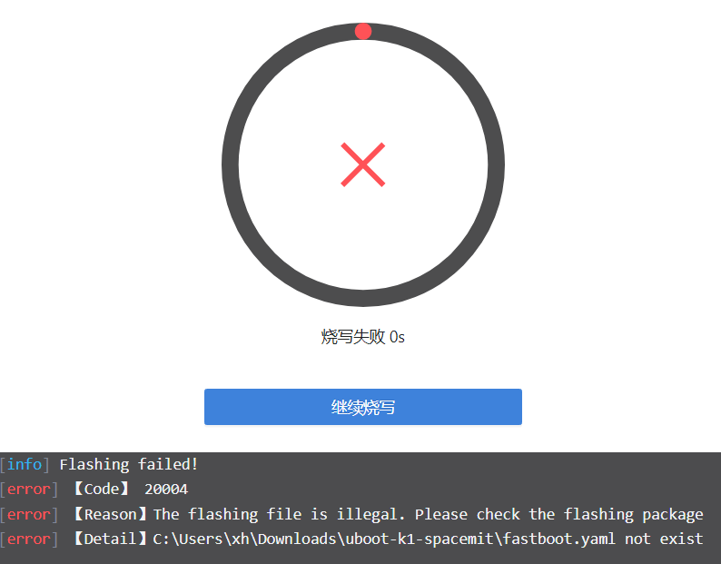

解决办法是找到 Bianbu 能直接用 titan 刷机的镜像的 zip，使用已经写好的配置文件解压后作为刷机目录，然后配置分区文件：

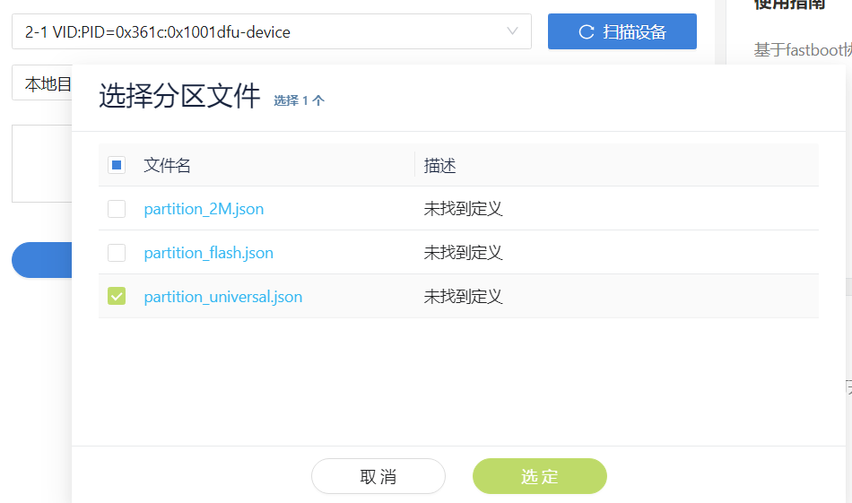

将里面的文件替换为 deepin 两个文件解压后里面的内容，包括 root\boot\u-boot 等，示例如图：

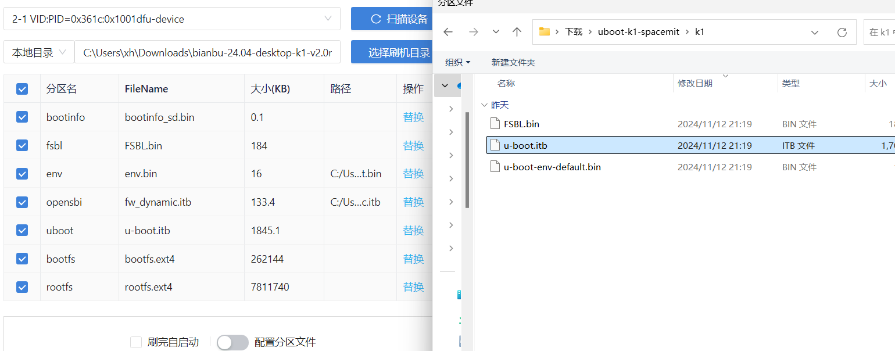

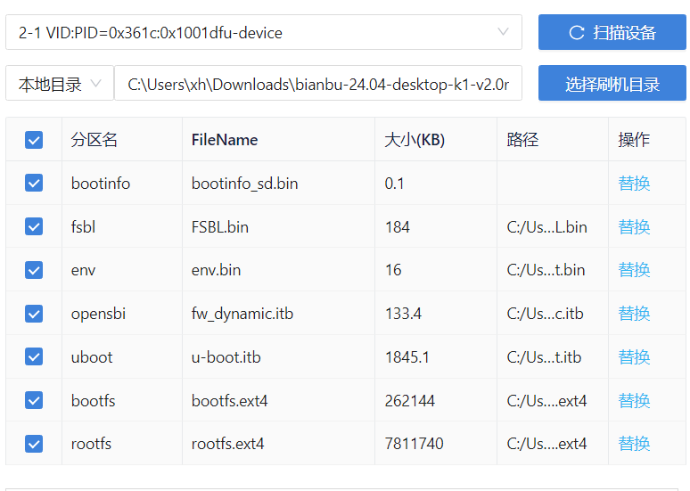

替换完成点击开始刷机即可，等待烧录完成

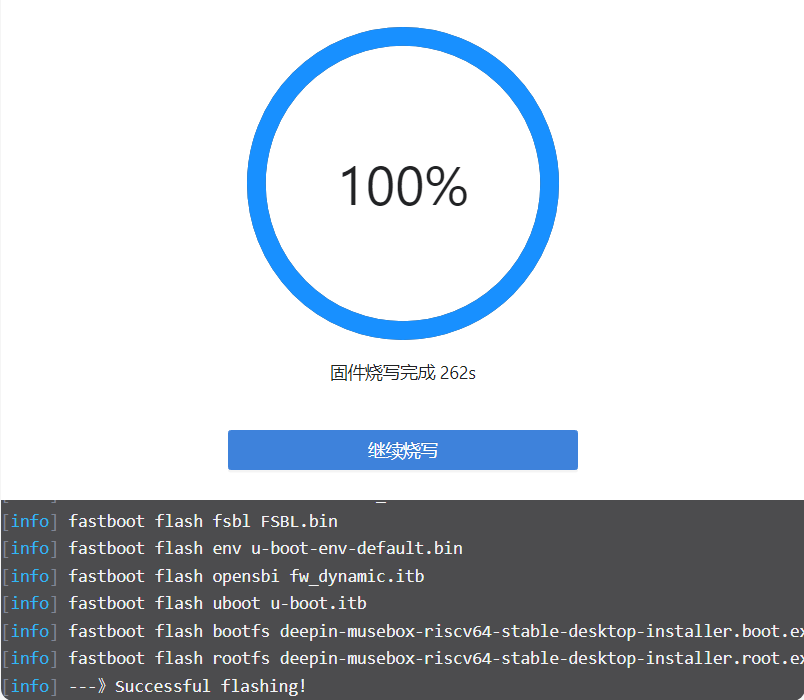

烧录成功，但是尝试开机进系统失败，接下来连接串口进行检查。

##  二、分区问题处理

*使用 RV DebuggerPlus 连接开发板

参考[sipeed文档](https://wiki.sipeed.com/hardware/zh/lichee/K1/lpi3a/4_peripheral.html)进行连接：

*（这里注意板子要记得插电！不然没有信号）*

插上去之后在设备管理器中确认板子的端口号：

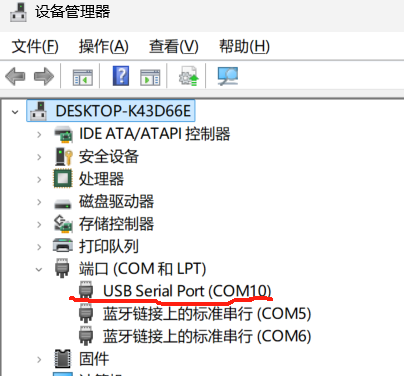

使用串口工具 Putty 进行通信,配置如下，端口号为上图中看到的。

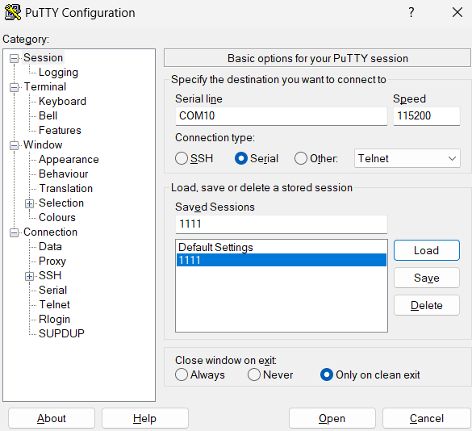

连接上之后查看日志：

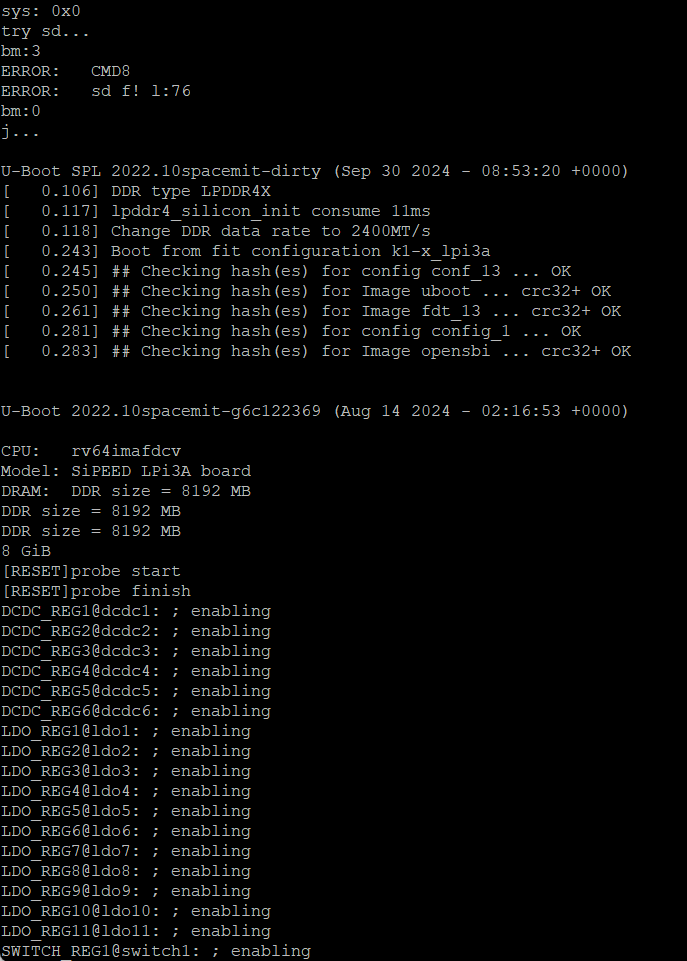

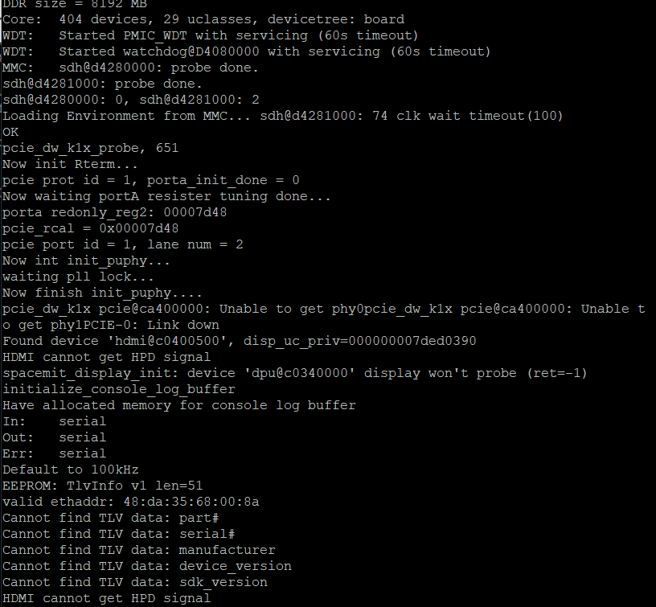

发现存在问题：

考虑可能内核版本号和  dtb 路径存在问题，查看一下版本号和 dtb 的路径：

版本号：

dtb 路径：

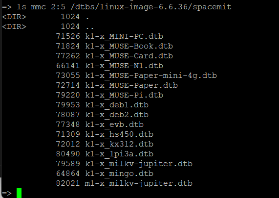

再 printenv 检查一下环境设置，发现问题：

1、kernel 和 ramdisk 版本号不符

2、dtbs 路径设置不符

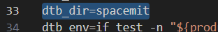

使用 setenv 修改一下

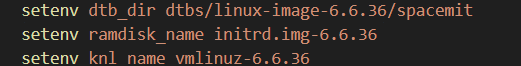

Printenv 确认一遍三个位置均修改成功再次 boot ，还是有报错：

log 如图所示：

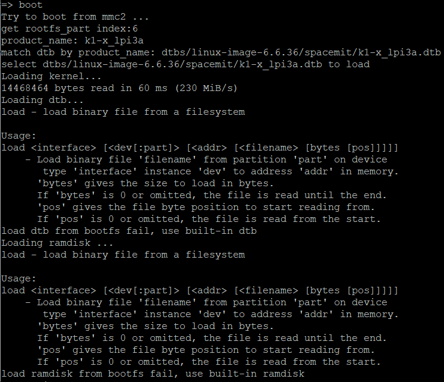

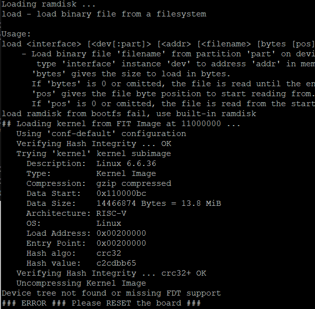

从 log 可以看到，是在 load ramdisk 和 load dtb 环节出现了问题，检查了一遍 env 发现: dtb_addr 和 ramdisk_addr 没有声明：

去 bianbu 的 env.bin 里面扒拉到 dtb_addr 和 ramdisk_addr 用一下，将 dtb_addr 和 ramdisk_addr 声明补上：

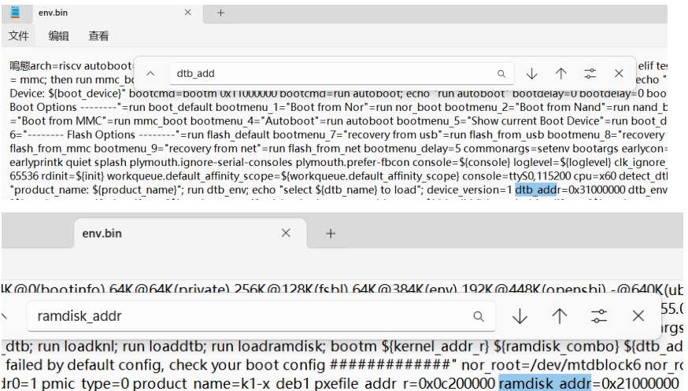

再次设置环境后重新尝试 boot：

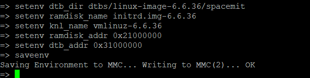

boot 成功，成功进入系统！

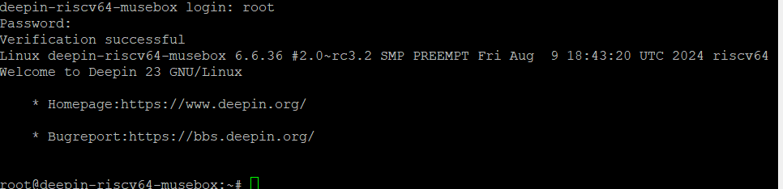

PS：启动过程中仍然存在部分问题，这里先只做记录：

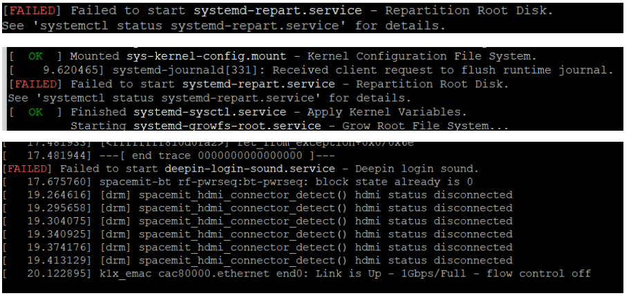

*这个状态可以 ssh 作为服务器连接，但是直接连接显示器+键盘时无法独立操作

显示如下：

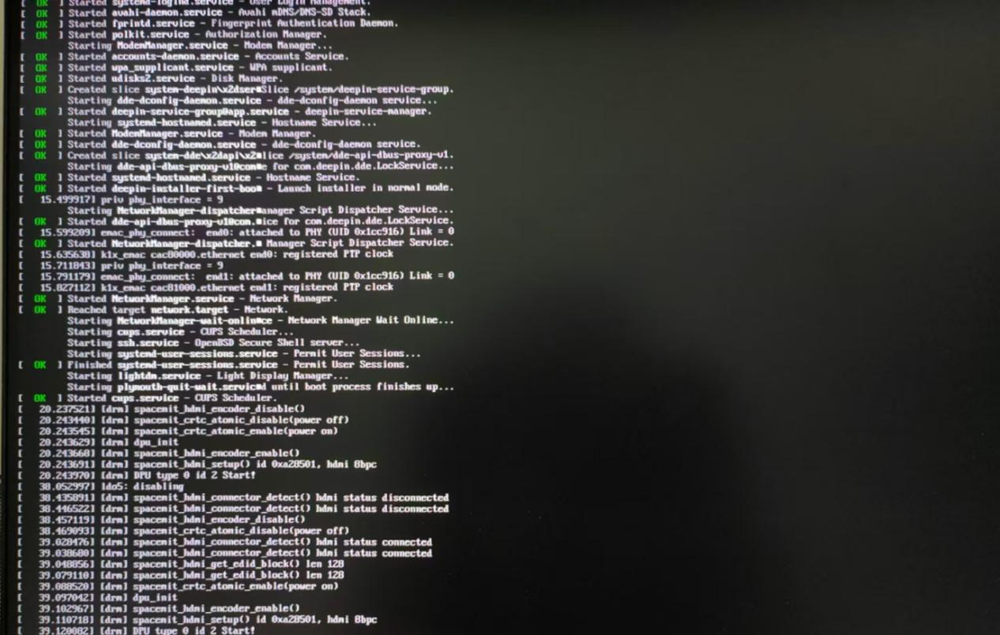

##  三、总结

镜像烧录过程中发现问题：

Deepin 系统对 LicheePi Module 3A 是有支持的

怀疑uboot导入时没有正确引导使用 boot.ext4 中 extlinux 的环境配置，使用了 env-k1-x.txt 中的环境配置，但该环境配置存在存在问题：

环境中中 knl(kernel) 和 ramdisk 版本号不符、 dtb_addr 和 ramdisk_addr 没有声明、 load dtb 路径不符

故镜像无法开箱即用。本文测试过程中手动修复了环境问题，可以成功开机。

除此之外可能存在其他使用的问题，暂时有待进一步测试。

附最后一次boot的日志和开机日志 .txt

鸣谢 @Zhiyuan Wan  协力
