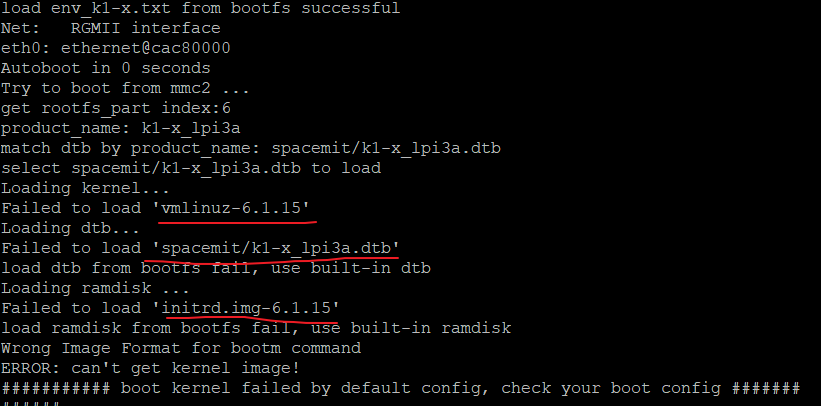

###  RISC-V实体设备LicheePi Module 3A安装deepin操作系统 测试记录
##  一、镜像烧录
**工具准备**

操作环境：win11  设备：LicheePi 3A  [板卡介绍](https://wiki.sipeed.com/hardware/zh/lichee/K1/lpi3a/1_intro.html)

**烧录参考**：

[Sipeed wiki](https://wiki.sipeed.com/hardware/zh/lichee/K1/lpi3a/3_burn_image.html)   or

[进迭时空](https://developer.spacemit.com/documentation?token=O6wlwlXcoiBZUikVNh2cczhin5d)

工具：[Titan Flasher](https://cloud.spacemit.com/prod-api/release/download/tools?token=titantools_for_windows_X86_X64)

**镜像获取**：

[deepin20240815](https://ci.deepin.com/repo/deepin/deepin-ports/cdimage/20240815/riscv64/）

下载：deepin-23-beige-preview-riscv64-musebox-20240815-115503.
  及  uboot-k1-spacemit.zip
  
**辅助工具：（用途后文解释）**

Bianbu镜像包:https://archive.spacemit.com/image/k1/version/bianbu/v2.0rc2/

**烧录过程** 

按住boot将开发板usb连接电脑，使用titan扫描设备能扫描到即可

本地文件需要打包好的zip格式，使用zip的话还需要再titan工具内解压，需要一定时间。
*建议手动解压完成后使用本地目录刷机
目前,如果只使用deepin的两个文件解压（*window下需使用7-zip解压）拼起来作为刷机目录的话会发现缺失配置文件:

解决办法是找到Bianbu能直接用titan刷机的镜像的zip，使用已经写好的配置文件解压后作为刷机目录，然后配置分区文件：

将里面的文件替换为deepin两个文件解压后里面的内容，包括root\boot\u-tool等，示例如图：

替换完成点击开始刷机即可，等待烧录完成

烧录成功，但是尝试开机进系统失败，接下来连接串口进行检查。

##  二、分区问题处理

*使用RV DebuggerPlus连接开发板

参考[sipeed文档](https://wiki.sipeed.com/hardware/zh/lichee/K1/lpi3a/4_peripheral.html)进行连接：

*（这里注意板子要记得插电！！！！不然没有信号）*

插上去之后在设备管理器中确认板子的端口号：

使用串口工具putty进行通信,配置如下，端口号为上图中看到的。

连接上之后查看日志：

发现存在问题：

考虑可能内核版本号和dtb路径存在问题，查看一下版本号和dtbs的路径：

版本号：

dtbs路径

再printenv检查一下环境设置，发现问题：

1、kernel和ramdisk版本号不符

2、dtbs路径设置不符

使用setenv修改一下

Printenv确认一遍三个位置均修改成功再次boot，还是有报错：

log 如图所示

从log可以看到，是在load ramdisk和load dtb环节出现了问题，检查了一遍env发现:dtb_addr和ramdisk_addr没有声明

去bianbu的env.bin里面扒拉到dtb_addr和ramdisk_addr用一下，将dtb_addr和ramdisk_addr声明补上

再次设置环境后重新尝试boot

boot成功，成功进入系统！

PS：启动过程中仍然存在部分问题，这里先只做记录

*这个状态可以ssh作为服务器连接，但是直接连接显示器+键盘时无法独立操作

显示如下：

##  三、总结

镜像烧录过程中发现问题：
Deepin系统对 LicheePi Module 3A 是有支持的
怀疑uboot导入时没有正确引导使用boot.ext4中extlinux的环境配置，使用了env-k1-x.txt中的环境配置，但该配置存在问题：

env中knl和ramdisk版本号不符、dtb_addr和ramdisk_addr没有声明、load dtb路径不符

故导致改镜像无法开箱即用。本文测试过程中手动修复了环境问题，可以成功开机。

除此之外可能存在其他使用的问题，暂时有待进一步测试。

附最后一次boot的日志和开机日志 .txt

鸣谢 @Zhiyuan Wan  协力
